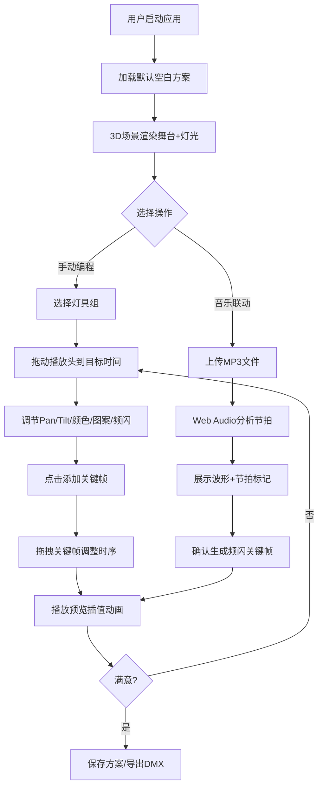

## 1. 产品概述

基于Three.js的3D可视化舞台灯光编程工具，为灯光设计师提供直观的预演环境。用户可在虚拟舞台上编程摇头灯的运动轨迹、颜色变化、图案和频闪效果，支持音乐节拍自动生成关键帧，并导出为DMX 512控制指令。

- **目标用户**：舞台灯光设计师、演出策划人员、灯光编程爱好者
- **核心价值**：降低灯光编程门槛，通过3D可视化实时预览效果，提高设计效率

---

## 2. 核心功能

### 2.1 用户角色

| 角色 | 注册方式 | 核心权限 |
|------|----------|----------|
| 灯光设计师 | 无需注册，本地运行 | 创建/编辑/保存灯光秀方案、导出DMX指令、上传音乐分析节拍 |

### 2.2 功能模块

1. **3D舞台场景视图**：舞台模型、灯架、8组摇头灯、虚拟演员、实时灯光渲染
2. **灯光属性控制面板**：选择灯具组，调节Pan/Tilt角度、RGB颜色、图案、频闪速度
3. **时间轴编辑器**：秒级精度时间轴、关键帧添加/删除/拖拽、线性插值预览、播放控制
4. **音乐节拍分析**：上传MP3、BPM检测、节拍点识别、自动生成频闪关键帧
5. **方案管理**：保存多个灯光秀方案（JSON）、方案列表切换、方案对比预览
6. **导出功能**：DMX 512格式CSV导出、时间码对齐、通道映射配置

### 2.3 页面详情

| 页面名称 | 模块名称 | 功能描述 |
|----------|----------|----------|
| 主工作台 | 3D场景画布 | Three.js渲染舞台，OrbitControls相机控制，实时灯光效果预览 |
| 主工作台 | 左侧灯具面板 | 8组摇头灯列表，分组选择，状态指示灯，快捷定位视角 |
| 主工作台 | 右侧属性面板 | 当前选中灯具/关键帧的属性编辑器：Pan/Tilt滑块、RGB颜色拾取器、图案下拉、频闪Hz输入 |
| 主工作台 | 底部时间轴 | 多轨道时间轴（8组灯独立轨道），关键帧拖拽，缩放，播放头定位 |
| 主工作台 | 顶部工具栏 | 新建/保存/加载方案、音乐上传按钮、DMX导出、黑场按钮、播放/暂停控制 |
| 节拍分析弹窗 | 音乐分析面板 | 波形可视化、BPM显示、节拍标记预览、确认生成频闪关键帧 |
| 方案管理弹窗 | 方案列表面板 | 方案卡片网格、缩略图预览、切换对比、删除、重命名 |

---

## 3. 核心流程

### 3.1 灯光编程主流程

用户创建新方案 → 在3D视图中选择灯具组 → 调节时间轴播放头位置 → 设置灯光属性并添加关键帧 → 拖拽关键帧调整时序 → 播放预览插值动画 → 重复编辑直至满意 → 保存方案或导出DMX

### 3.2 音乐节拍联动流程

用户点击"上传音乐" → 选择MP3文件 → Web Audio API解码音频 → 分析低频能量检测BPM和节拍点 → 弹窗展示波形与节拍标记 → 用户确认 → 自动在各灯具轨道的节拍位置插入频闪关键帧 → 用户可进一步微调

### 3.3 Mermaid流程图

---

## 4. 用户界面设计

### 4.1 设计风格

- **设计方向**：赛博工业风（Cyber-Industrial）—— 专业控制台美学，深色底配霓虹色高亮，棱角分明的几何元素
- **主色**：深空灰 `#0a0e17`，面板深灰 `#141b2d`，边框蓝灰 `#1e2a45`
- **强调色**：舞台金 `#ffc107`，警戒红 `#ff3d57`，运行绿 `#00e5a0`，技术蓝 `#2196ff`，霓虹紫 `#a855f7`
- **按钮风格**：方形微圆角（3px），内嵌阴影，按下有凹陷效果，功能按钮配状态LED指示灯
- **字体**：显示字体 `Orbitron`（科技感标题），正文字体 `JetBrains Mono`（等宽控制台字体）
- **布局风格**：Dock式多面板布局，可拖拽分隔条，面板标题带发光下划线
- **视觉细节**：扫描线纹理叠加、霓虹发光边框、LED点阵状态指示、机械刻度滑块

### 4.2 页面设计概述

| 页面名称 | 模块名称 | UI元素 |
|----------|----------|--------|
| 主工作台 | 3D场景画布 | 占中央区域，顶部叠加状态信息条（FPS、当前时间码、方案名），四角有发光渐变遮罩 |
| 主工作台 | 左侧灯具面板 | 280px宽，8组灯卡片，每组显示编号、状态LED圆点、当前颜色预览方块、选中时金色边框发光 |
| 主工作台 | 右侧属性面板 | 320px宽，分区折叠面板：位置（Pan/Tilt带刻度盘）、颜色（RGB滑块+拾色器）、图案（下拉+预览）、频闪（Hz滑块+开关） |
| 主工作台 | 底部时间轴 | 200px高，9行轨道（1行时间标尺+8行灯具轨道），关键帧为菱形（金色），可横向拖拽，播放头为红色扫描线 |
| 主工作台 | 顶部工具栏 | 48px高，深色条带，左侧Logo+方案名，中部功能按钮组（带图标+文字），右侧播放控制+时间码显示 |
| 节拍分析弹窗 | 音乐分析面板 | 居中模态框，800px宽，Canvas绘制波形+蓝色节拍竖线，BPM数字大号显示，确认/取消按钮 |
| 方案管理弹窗 | 方案列表面板 | 居中模态框，网格布局3列，方案卡片带缩略图（3D场景快照）、名称、创建时间、操作按钮 |

### 4.3 响应式设计

- **设计优先**：桌面端优先（最低1440x900），充分利用宽屏多面板布局
- **适配策略**：
  - ≥1680px：面板按固定宽度，3D区域自适应填充
  - 1280~1680px：面板宽度按比例缩减15%
  - <1280px：隐藏次要面板，提供折叠/展开切换按钮
- **触控优化**：关键帧拖拽区域≥24x24px，滑块加粗便于触屏操作

### 4.4 3D场景指引

- **环境与氛围**：黑色背景 + 薄雾效果（FogExp2，密度0.015），模拟剧场暗环境；环境光极弱（0.1x），主光源完全来自8组摇头灯
- **灯光设置**：
  - 舞台面光：2组（前左/前右），SpotLight，模拟常规照明
  - 摇头灯×8：每组含聚光（SpotLight，目标跟随Pan/Tilt角度）+ 光柱（聚光锥半透明材质）+ 灯体模型
  - 光束可见性：使用VolumetricLight后处理或半透明圆锥模拟光束
- **相机设置**：PerspectiveCamera（fov=50），初始位置(0, 8, 22) 俯看舞台；OrbitControls支持环绕、缩放、平移；保存6个快捷视角（正面、侧面、顶视、灯架A、灯架B、演员特写）
- **构图与焦点**：舞台位于场景中心(0,0,0)，尺寸20m(宽)×10m(深)×1m(高)；灯架分为前桁架(距舞台前3m，高8m)和后桁架(距舞台后3m，高9m)，各4组灯均匀分布
- **交互与动画**：
  - 悬停灯具高亮，点击选中（金色外框发光）
  - 播放时灯具实时旋转、颜色渐变、光束开闭
  - 虚拟演员（3个球体）在舞台上有预设运动路径（可开关）
- **后处理效果**：Bloom（发光阈值0.3，强度1.2）增强光束视觉，Vignette暗角强化舞台聚焦感，轻微FXAA抗锯齿
- **性能预算**：单场景≤5000面，Draw Call≤100，目标FPS≥45（中高端桌面独显）
