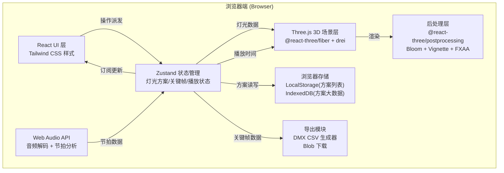
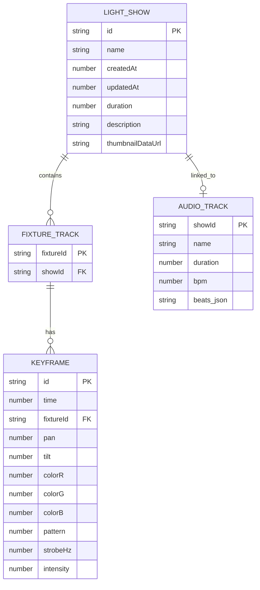

## 1. 架构设计

纯前端单页应用，无后端服务器依赖，所有数据存储在浏览器LocalStorage/IndexedDB中，文件通过浏览器File API导入导出。



---

## 2. 技术描述

### 2.1 核心技术栈

| 类别 | 技术 | 版本 | 用途 |
|------|------|------|------|
| 构建工具 | Vite | ^5.0 | 快速开发构建，支持ESM HMR |
| UI框架 | React | ^18.2 | 函数组件 + Hooks |
| 语言 | TypeScript | ^5.3 | 类型安全开发 |
| 样式 | Tailwind CSS | ^3.4 | 原子化CSS，赛博工业风主题 |
| 3D引擎 | three | ^0.160 | 3D渲染核心 |
| React 3D | @react-three/fiber | ^8.15 | Three.js React绑定 |
| 3D助手库 | @react-three/drei | ^9.92 | OrbitControls、常用几何体等 |
| 后处理 | @react-three/postprocessing | ^2.15 | Bloom、Vignette、FXAA |
| 状态管理 | zustand | ^4.4 | 轻量状态管理，支持中间件持久化 |
| 图标 | lucide-react | ^0.294 | SVG图标库 |
| 音频分析 | Web Audio API | (原生) | AudioContext、AnalyserNode |

### 2.2 项目初始化

```bash
npm create vite@latest stage-lighting-studio -- --template react-ts
cd stage-lighting-studio
npm install three @react-three/fiber @react-three/drei @react-three/postprocessing zustand lucide-react
npm install -D tailwindcss postcss autoprefixer @types/three
npx tailwindcss init -p
```

---

## 3. 目录结构与路由

### 3.1 单页应用，无路由

由于是工具型单页应用，所有功能在同一工作台页面内通过面板/弹窗组织，无需React Router。

```
src/
├── main.tsx                     应用入口
├── App.tsx                      主工作台布局（多面板容器）
├── index.css                    Tailwind入口 + 全局样式 + 赛博工业风主题CSS变量
├── types/
│   └── index.ts                 核心类型定义（灯光、关键帧、方案、DMX通道）
├── store/
│   └── useLightingStore.ts      Zustand全局状态管理
├── components/
│   ├── layout/
│   │   ├── TopToolbar.tsx       顶部工具栏
│   │   ├── LeftFixturePanel.tsx 左侧灯具列表面板
│   │   ├── RightPropertyPanel.tsx 右侧属性编辑面板
│   │   └── BottomTimeline.tsx   底部时间轴编辑器
│   ├── scene3d/
│   │   ├── StageCanvas.tsx      R3F Canvas容器
│   │   ├── Stage.tsx            舞台地板模型
│   │   ├── Truss.tsx            灯架桁架模型
│   │   ├── MovingHead.tsx       摇头灯单体组件（含灯体+光束+SpotLight）
│   │   ├── VirtualPerformer.tsx 虚拟演员（球体）
│   │   └── SceneEnvironment.tsx 雾效、环境光、后处理
│   ├── modals/
│   │   ├── BeatAnalysisModal.tsx 音乐节拍分析弹窗
│   │   └── ShowManagerModal.tsx  方案管理弹窗
│   └── common/
│       ├── DialKnob.tsx         旋钮刻度盘组件（Pan/Tilt）
│       ├── ColorPicker.tsx      RGB颜色选择器
│       └── StrobeSlider.tsx     频闪频率滑块
├── utils/
│   ├── interpolation.ts         关键帧线性插值引擎
│   ├── beatAnalyzer.ts          音频节拍分析算法
│   ├── dmxExporter.ts           DMX 512 CSV导出器
│   └── showSerializer.ts        方案JSON序列化/反序列化
└── hooks/
    └── usePlaybackEngine.ts     播放控制Hook（requestAnimationFrame驱动）
```

---

## 4. 数据模型

### 4.1 核心类型定义（types/index.ts）

```typescript
/** 摇头灯ID (1-8) */
export type FixtureId = 1 | 2 | 3 | 4 | 5 | 6 | 7 | 8;

/** 灯光属性状态 */
export interface LightState {
  pan: number;           // 水平旋转角度 [-180, 180] 度
  tilt: number;          // 垂直旋转角度 [-90, 90] 度
  colorR: number;        // 红色通道 [0, 255]
  colorG: number;        // 绿色通道 [0, 255]
  colorB: number;        // 蓝色通道 [0, 255]
  pattern: number;       // 图案索引 [0, 7] (0=无图案)
  strobeHz: number;      // 频闪频率 [0, 30] Hz (0=常亮)
  intensity: number;     // 亮度 [0, 100] %
}

/** 单个关键帧 */
export interface Keyframe {
  id: string;                     // 唯一ID (uuid)
  time: number;                   // 时间点，秒，精度0.01
  fixtureId: FixtureId;           // 所属灯具组
  state: Partial<LightState>;     // 此关键帧设置的属性（支持局部属性）
}

/** 单个灯具轨道 */
export interface FixtureTrack {
  fixtureId: FixtureId;
  keyframes: Keyframe[];          // 按time升序排列
}

/** 灯光秀方案 */
export interface LightShow {
  id: string;                      // 方案唯一ID
  name: string;                    // 方案名称
  createdAt: number;               // 创建时间戳
  updatedAt: number;               // 最后更新时间戳
  duration: number;                // 总时长（秒）
  description?: string;            // 备注描述
  thumbnailDataUrl?: string;       // 缩略图base64 (可选)
  tracks: FixtureTrack[];          // 8个灯具轨道
  audioTrack?: {                   // 关联的音乐轨（可选）
    name: string;
    duration: number;
    beats: number[];               // 节拍时间点数组
    bpm: number;
  };
}

/** DMX通道映射（每组灯12个通道） */
export interface DMXChannelMap {
  pan: number;         // 通道1 (0-511)
  panFine: number;     // 通道2
  tilt: number;        // 通道3
  tiltFine: number;    // 通道4
  intensity: number;   // 通道5
  strobe: number;      // 通道6
  colorR: number;      // 通道7
  colorG: number;      // 通道8
  colorB: number;      // 通道9
  pattern: number;     // 通道10
  reserved1: number;   // 通道11
  reserved2: number;   // 通道12
}

/** DMX导出配置 */
export interface DMXExportConfig {
  frameRate: number;          // 输出帧率（默认30fps）
  startAddress: Record<FixtureId, number>;  // 每组灯的起始DMX地址
  channelMap: DMXChannelMap;  // 通道布局映射
}
```

### 4.2 Mermaid ER图



---

## 5. 状态管理设计（Zustand Store）

### 5.1 Store 切片结构

```typescript
// store/useLightingStore.ts
interface LightingState {
  // === 方案相关 ===
  shows: LightShow[];                    // 所有方案列表
  activeShowId: string | null;           // 当前编辑的方案ID
  activeShow: LightShow | null;          // 计算属性：当前方案

  // === 播放相关 ===
  currentTime: number;                   // 当前播放头时间（秒）
  isPlaying: boolean;                    // 是否正在播放
  playbackSpeed: number;                 // 播放速度倍率（0.25x~4x）
  isBlackout: boolean;                   // 黑场状态

  // === 编辑相关 ===
  selectedFixtureId: FixtureId | null;   // 当前选中的灯具组
  selectedKeyframeId: string | null;     // 当前选中的关键帧ID
  previewState: Record<FixtureId, LightState>;  // 实时插值结果

  // === UI相关 ===
  showBeatModal: boolean;
  showManagerModal: boolean;
  timelineScale: number;                 // 时间轴缩放（像素/秒）
  compareShowId: string | null;          // 对比中的方案ID
}

interface LightingActions {
  // 方案操作
  createShow: (name?: string) => string;
  duplicateShow: (id: string) => string;
  deleteShow: (id: string) => void;
  renameShow: (id: string, name: string) => void;
  switchShow: (id: string) => void;
  saveShowToFile: (id: string) => void;
  loadShowFromFile: (file: File) => Promise<string>;

  // 关键帧操作
  addKeyframe: (fixtureId: FixtureId, time: number, state: Partial<LightState>) => string;
  deleteKeyframe: (id: string) => void;
  updateKeyframe: (id: string, patch: Partial<Keyframe>) => void;
  moveKeyframe: (id: string, newTime: number) => void;

  // 播放控制
  play: () => void;
  pause: () => void;
  stop: () => void;
  seek: (time: number) => void;
  setPlaybackSpeed: (speed: number) => void;
  toggleBlackout: () => void;

  // 选择操作
  selectFixture: (id: FixtureId | null) => void;
  selectKeyframe: (id: string | null) => void;

  // 节拍分析
  analyzeAudioAndGenerateBeats: (file: File) => Promise<{bpm: number; beats: number[]}>;
  applyStrobeKeyframesFromBeats: (beats: number[], fixtureIds: FixtureId[]) => void;

  // 导出
  exportDMX: (showId: string, config?: Partial<DMXExportConfig>) => void;
}
```

---

## 6. 关键算法设计

### 6.1 线性插值引擎（utils/interpolation.ts）

- 输入：某灯具组的关键帧数组 + 查询时间t
- 输出：完整插值后的LightState
- 算法：
  1. 二分查找定位t前后的两个关键帧 k_prev 和 k_next
  2. 计算插值因子 factor = (t - k_prev.time) / (k_next.time - k_prev.time)
  3. 对每个数值属性执行线性插值：`v = v_prev + (v_next - v_prev) * factor`
  4. 非数值属性（pattern）取最近关键帧的值
  5. 若t < 第一个关键帧时间 → 返回首帧；若t > 末帧 → 返回末帧
  6. 频闪使用高频方波函数：`on = frac(t * strobeHz) < 0.5`，关闭时亮度归零

### 6.2 节拍检测算法（utils/beatAnalyzer.ts）

基于 Web Audio API 的轻量节拍检测：
1. AudioContext.decodeAudioData 解码MP3为AudioBuffer
2. 取左声道混合单声道，降采样到8kHz
3. 按512样本分帧，对每帧计算RMS能量（聚焦20~200Hz低频带）
4. 计算能量曲线的局部峰值，阈值设为移动平均的1.5倍
5. 对峰值间距做直方图统计，取众数间距推算BPM
6. 用BPM对齐所有峰值，输出精确节拍时间点数组

### 6.3 DMX 512 导出格式（utils/dmxExporter.ts）

CSV格式，每行一个时间帧，列结构：
```
Time(sec), Universe, Channel_1, Channel_2, ..., Channel_512
0.000,      1,        128,       0,         ..., 0
0.033,      1,        128,       0,         ..., 0
...
```

- Pan/Tilt: 角度值映射到 [0, 65535]，高8位进粗调通道，低8位进微调通道
- RGB: 直接映射 [0, 255]
- Strobe: 0=关闭, 10~255=对应频闪速度
- Pattern: 索引×32 映射到 [0, 255]

---

## 7. 性能优化策略

1. **3D渲染**：摇头灯光束使用实例化Mesh（InstancedMesh）减少Draw Call
2. **后处理**：Bloom仅对高强度发光物体生效，设置mipmapBlur:true
3. **状态更新**：Zustand使用selector避免不必要重渲染，3D场景通过useFrame读取
4. **时间轴绘制**：Canvas 2D绘制关键帧，不使用DOM元素，支持万级关键帧流畅拖拽
5. **插值计算**：对每个灯具track建立索引，播放时每帧O(log n)二分查找
6. **音频分析**：Web Worker中执行节拍检测算法，避免阻塞主线程
